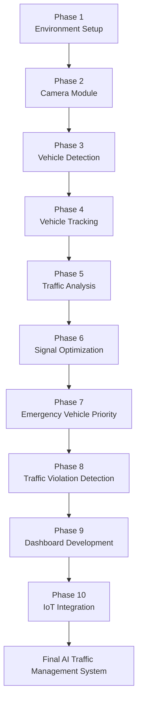

```mermaid
flowchart TD

A[Phase 1<br>Environment Setup]

A-->B[Phase 2<br>Camera Module]

B-->C[Phase 3<br>Vehicle Detection]

C-->D[Phase 4<br>Vehicle Tracking]

D-->E[Phase 5<br>Traffic Analysis]

E-->F[Phase 6<br>Signal Optimization]

F-->G[Phase 7<br>Emergency Vehicle Priority]

G-->H[Phase 8<br>Traffic Violation Detection]

H-->I[Phase 9<br>Dashboard Development]

I-->J[Phase 10<br>IoT Integration]

J-->K[Final AI Traffic Management System]
```
