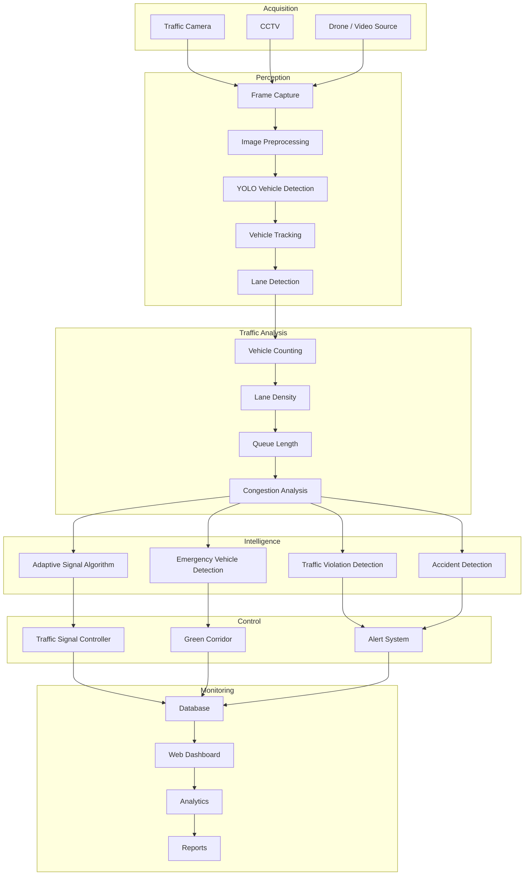

```mermaid
flowchart TB

subgraph Acquisition
A1[Traffic Camera]
A2[CCTV]
A3[Drone / Video Source]
end

subgraph Perception
B1[Frame Capture]
B2[Image Preprocessing]
B3[YOLO Vehicle Detection]
B4[Vehicle Tracking]
B5[Lane Detection]
end

subgraph Traffic Analysis
C1[Vehicle Counting]
C2[Lane Density]
C3[Queue Length]
C4[Congestion Analysis]
end

subgraph Intelligence
D1[Adaptive Signal Algorithm]
D2[Emergency Vehicle Detection]
D3[Traffic Violation Detection]
D4[Accident Detection]
end

subgraph Control
E1[Traffic Signal Controller]
E2[Green Corridor]
E3[Alert System]
end

subgraph Monitoring
F1[Database]
F2[Web Dashboard]
F3[Analytics]
F4[Reports]
end

A1-->B1
A2-->B1
A3-->B1

B1-->B2
B2-->B3
B3-->B4
B4-->B5

B5-->C1
C1-->C2
C2-->C3
C3-->C4

C4-->D1
C4-->D2
C4-->D3
C4-->D4

D1-->E1
D2-->E2
D3-->E3
D4-->E3

E1-->F1
E2-->F1
E3-->F1

F1-->F2
F2-->F3
F3-->F4
```
