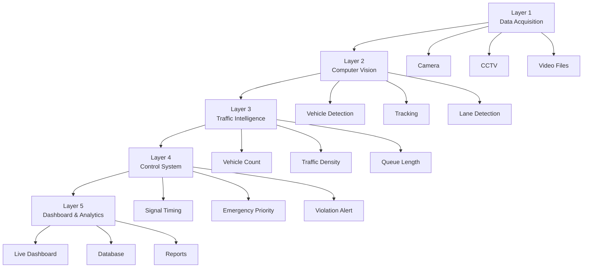

```mermaid
flowchart TD

A["Layer 1<br>Data Acquisition"]

-->

B["Layer 2<br>Computer Vision"]

-->

C["Layer 3<br>Traffic Intelligence"]

-->

D["Layer 4<br>Control System"]

-->

E["Layer 5<br>Dashboard & Analytics"]

A1[Camera]
A2[CCTV]
A3[Video Files]

A-->A1
A-->A2
A-->A3

B-->B1[Vehicle Detection]
B-->B2[Tracking]
B-->B3[Lane Detection]

C-->C1[Vehicle Count]
C-->C2[Traffic Density]
C-->C3[Queue Length]

D-->D1[Signal Timing]
D-->D2[Emergency Priority]
D-->D3[Violation Alert]

E-->E1[Live Dashboard]
E-->E2[Database]
E-->E3[Reports]
```
