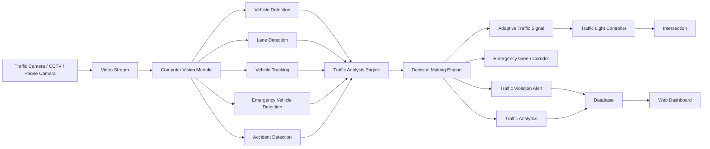

```mermaid
flowchart LR

A[Traffic Camera / CCTV / Phone Camera]
-->B[Video Stream]

B-->C[Computer Vision Module]

C-->D[Vehicle Detection]
C-->E[Lane Detection]
C-->F[Vehicle Tracking]
C-->G[Emergency Vehicle Detection]
C-->H[Accident Detection]

D-->I[Traffic Analysis Engine]
E-->I
F-->I
G-->I
H-->I

I-->J[Decision Making Engine]

J-->K[Adaptive Traffic Signal]
J-->L[Emergency Green Corridor]
J-->M[Traffic Violation Alert]
J-->N[Traffic Analytics]

K-->O[Traffic Light Controller]

O-->P[Intersection]

M-->Q[Database]
N-->Q

Q-->R[Web Dashboard]
```
