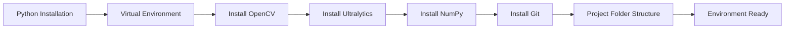

```mermaid
flowchart LR

A[Python Installation]

A-->B[Virtual Environment]

B-->C[Install OpenCV]

C-->D[Install Ultralytics]

D-->E[Install NumPy]

E-->F[Install Git]

F-->G[Project Folder Structure]

G-->H[Environment Ready]
```
