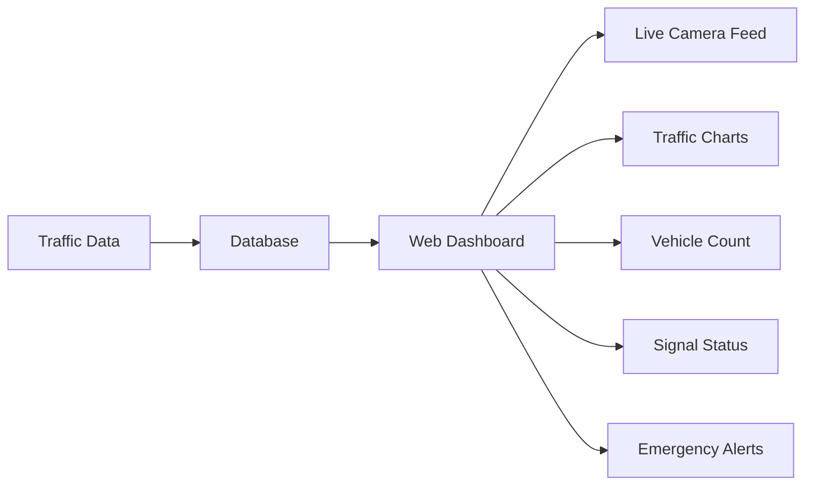

```mermaid
flowchart LR

A[Traffic Data]

-->

B[Database]

-->

C[Web Dashboard]

-->

D[Live Camera Feed]

C-->E[Traffic Charts]

C-->F[Vehicle Count]

C-->G[Signal Status]

C-->H[Emergency Alerts]
```
